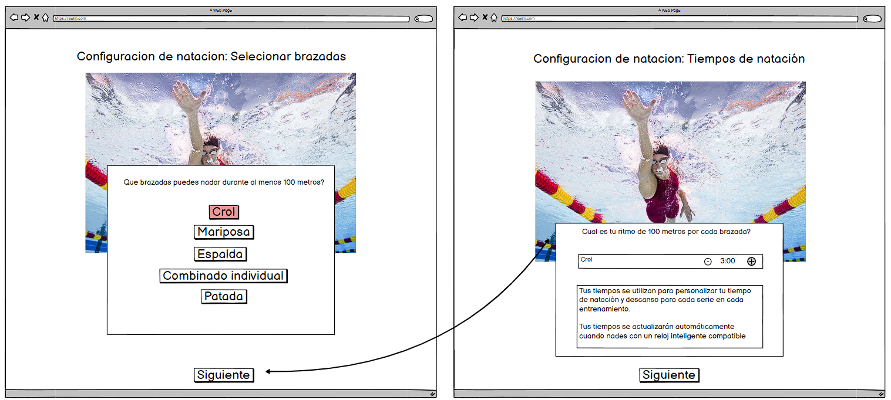

# Historia: Registro de Inicial
Título: Registro de todos los datos para la configuracion incial 

- Como usuario de la aplicación de natación,
- Quiero poder recuperar mis configuraciones de entrenamiento previamente guardadas,
- Para que pueda revisar o modificar mis objetivos y detalles de entrenamiento sin tener que reintroducir toda la información.

## Pendientes de Definición
1. ¿Dónde se almacenarán los datos del usuario? ¿En la nube, localmente, o en una base de datos?

## Especificaciones de Requerimientos
- Interfaz para ingreso de datos iniciales con selección de estilo, tiempo y distancia.


# Analisis

## Pantalla de registro inicial





## Criterios de Aceptación (Gherkin)
- Dado que el usuario ha iniciado sesión en la aplicación
    Y que el usuario no tiene configuraciones de entrenamiento previas guardadas
- Cuando el usuario navega a la sección "Configuración de natación"
- Entonces la aplicación informa al usuario que no hay datos guardados para recuperar

## Request/Response
Request:
```
GET /api/v1/swimming-config/{userId}
```


Response: Exitoso statusCode: 200
```
{
  "userId": "12345",
  "skillLevel": 3,
  "poolLength": "25m",
  "objectives": [
    {
      "description": "Acabo de empezar",
      "strokes": 100,
      "style": "Crol",
      "pace100m": "3:00"
    }
  ],
  "trainingDays": ["Lunes", "Miércoles", "Viernes"]
}


```