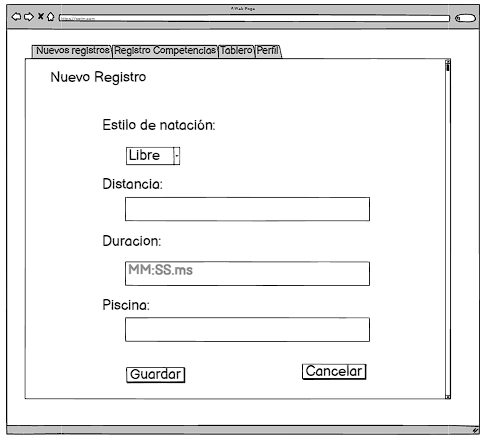

# Historia: Nuevo Registro
Título: Registro de estilo,distancia,duracion y largo de la piscina de nado personal

- Como nadador aficionado,
- Quiero poder registrar mis estilos,distancias,duracion y largo de la piscina de natación después de cada sesión,
- Para que pueda hacer seguimiento de mi progreso a lo largo del tiempo.

## Pendientes de Definición
1. Si hay restricciones en el tipo de estilo de natación que se puede ingresar.

## Especificaciones de Requerimientos
- Interfaz para ingreso de estilo de natación, distancia, duración y piscina.
- Validación de formato de tiempo para asegurar coherencia en los datos ingresados.
- Funcionalidad para editar y eliminar registros.

# Analisis

## Pantalla de nuevos registros


## Criterios de Aceptación (Gherkin)
- Dado que he ingresado información válida en todos los campos del "Nuevo Registro",
- Cuando selecciono "Guardar",
- Entonces el sistema almacena el registro y muestra una confirmación.

## Request/Response
Request:

POST /api/v1/times
```
{
  "swim_style": "freestyle",
  "distance": 100,
  "time": "00:01:45.30"
}
```


Response: Exitoso statusCode: 200
```
{
  "id": 12345,
  "swim_style": "freestyle",
  "distance": 100,
  "time": "00:01:45.30",
  "status": "success"
}

```
