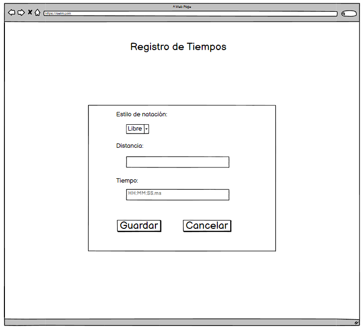

# Historia: Registro de Tiempos
Título: Registro de tiempos de natación personal

- Como nadador aficionado,
- Quiero poder registrar mis tiempos de natación después de cada sesión,
- Para que pueda hacer seguimiento de mi progreso a lo largo del tiempo.

## Pendientes de Definición
1. ¿Cómo se almacenan los registros?
2. ¿Qué formato tiene el archivo de registro?
3. ¿Cuál es la frecuencia de actualización del registro?

## Especificaciones de Requerimientos
- Interfaz para ingreso de tiempos con selección de estilo y distancia.
- Validación de formato de tiempo para asegurar coherencia en los datos ingresados.
- Funcionalidad para editar y eliminar registros.

# Analisis

## Pantalla de registro de tiempo junto al estilo y distancia


## Criterios de Aceptación (Gherkin)
- Dado que estoy en la página de registro de tiempos,
- Cuando ingreso y guardo mi tiempo de natación junto con el estilo y la distancia,
- Entonces ese tiempo se debe agregar a mi historial de tiempos y ser visible en mi perfil.

## Request/Response
Request:

POST /api/v1/times
```
{
  "swim_style": "freestyle",
  "distance": 100,
  "time": "00:01:45.30"
}
```


Response: Exitoso statusCode: 200
```
{
  "id": 12345,
  "swim_style": "freestyle",
  "distance": 100,
  "time": "00:01:45.30",
  "status": "success"
}

```
