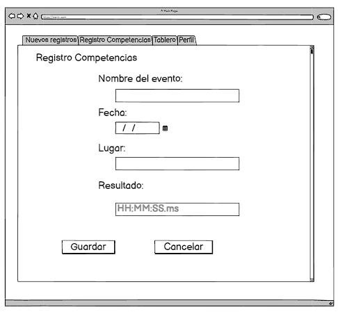

# Historia: Registro de competencia
Título: Gráficos de progreso

- Como nadador,
- Quiero registrar los detalles de mis competencias,
- Para que pueda ajustar los planes de entrenamiento de acuerdo a la evolución en las competencias.

## Pendientes de Definición
1. Formato y validación del campo de fecha y resultado.

## Especificaciones de Requerimientos
- Motor de gráficos para visualizar datos históricos.
- Funcionalidad de comparación de datos.

# Analisis

## Pantalla de regitro de competencias


## Criterios de Aceptación (Gherkin)
- Dado que completo los campos del "Registro Competencias",
- Cuando presiono "Guardar",
- Entonces el sistema registra los detalles del evento y muestra un mensaje de éxito.


## Request/Response
Response: 
GET /api/progress?swimmer_id=6789
```
{
  "swimmer_id": 6789,
  "style": "freestyle",
  "progress": [
    {"date": "2023-01-15", "time": "00:01:50.00"},
    {"date": "2023-02-15", "time": "00:01:48.00"},
    {"date": "2023-03-01", "time": "00:01:46.00"}
  ],
  "status": "success"
}


```

