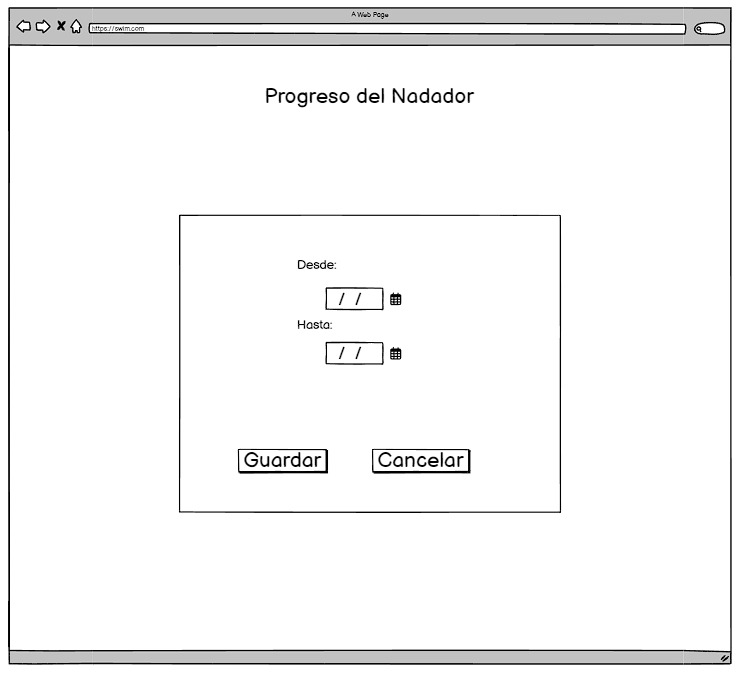

# Historia: Visualización de Progreso
Título: Gráficos de progreso

- Como entrenador de natación,
- Quiero poder ver gráficos del progreso de mis nadadores,
- Para que pueda ajustar los planes de entrenamiento de acuerdo con su evolución.

## Pendientes de Definición
1. Identificar qué tipo de gráficos son más útiles para los entrenadores.
2. Establecer si los gráficos deben ser interactivos (zoom, filtros dinámicos).

## Especificaciones de Requerimientos
- Motor de gráficos para visualizar datos históricos.
- Funcionalidad de comparación de datos.

# Analisis

## Pantalla de visualizacion de progreso dentro un rango específico


## Criterios de Aceptación (Gherkin)
- Dado que he seleccionado un rango de fechas en mi perfil de entrenador,
- Cuando miro el gráfico de progreso de un nadador,
- Entonces debo ver una línea de tiempo mostrando la evolución de sus tiempos dentro de ese rango específico.


## Request/Response
Response: 
GET /api/progress?swimmer_id=6789
```
{
  "swimmer_id": 6789,
  "style": "freestyle",
  "progress": [
    {"date": "2023-01-15", "time": "00:01:50.00"},
    {"date": "2023-02-15", "time": "00:01:48.00"},
    {"date": "2023-03-01", "time": "00:01:46.00"}
  ],
  "status": "success"
}


```

