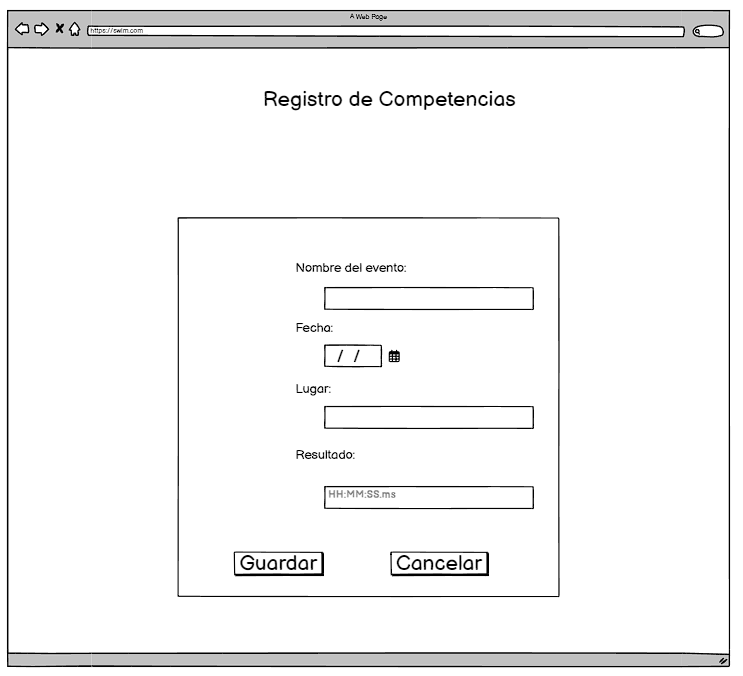

# Historia: Competencias y Resultados
Título: Seguimiento de competencias

- Como competidor en natación,
- Quiero poder registrar los resultados de las competencias en las que participo,
- Para que pueda tener un historial de mis actuaciones en eventos.

## Pendientes de Definición
1. Decidir qué información específica del evento debe ser registrada.
2. 

## Especificaciones de Requerimientos
- Formulario para entrada de datos de competencias.
- 

# Analisis

## Pantalla de Historial de Competencias


## Criterios de Aceptación (Gherkin)
- Dado que acabo de completar una competencia,
- Cuando ingreso y guardo los resultados de esa competencia,
- Entonces esos resultados deben aparecer en mi perfil bajo la sección "Historial de Competencias".

## Request/Response
Request:

POST /api/v1/competitions
```
{
  "event_name": "Spring Regional",
  "date": "2023-04-12",
  "location": "Aquatic Center",
  "result": "00:01:42.00",
  "position": 1
}
```


Response: Exitoso statusCode: 200
```
{
  "competition_id": 23456,
  "event_name": "Spring Regional",
  "status": "success"
}

```
