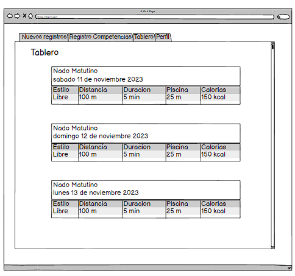

# Historia: Tablero
Título: Seguimiento de competencias

- Como nadador,
- Quiero ver un tablero de resultados y estadísticas de sesiones de entrenamiento,
- Para evaluar el rendimiento y mejorar las estrategias de entrenamiento.

## Pendientes de Definición
1. Cómo y con qué frecuencia se actualizará la información en el tablero.
2. 

## Especificaciones de Requerimientos
- Formulario para entrada de datos de competencias.
- 

# Analisis

## Pantalla de Historial de Competencias


## Criterios de Aceptación (Gherkin)
- Dado que deseo ver el resumen de las sesiones de entrenamiento,
- Cuando abro el "Tablero",
- Entonces se muestran los resultados de las sesiones más recientes.


## Request/Response
Request:

POST /api/v1/competitions
```
{
  "event_name": "Spring Regional",
  "date": "2023-04-12",
  "location": "Aquatic Center",
  "result": "00:01:42.00",
  "position": 1
}
```


Response: Exitoso statusCode: 200
```
{
  "competition_id": 23456,
  "event_name": "Spring Regional",
  "status": "success"
}

```
